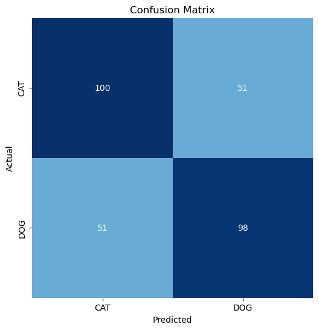

# Cat and Dog Image Classification

This project is a binary classification of 1000 cat and dog images from the Kaggle database using Convolutional Neural Networks. The goal is to build and train a model that can accurately distinguish between cat and dog images.

## Data

The data consists of 1000 PNG images of cats and dogs, which are split into 700 training images and 300 testing images. The images are stored in a folder named `Dog and Cat .png`, which contains two subfolders named `CAT` and `DOG`. The labels of the images are inferred from the subfolder names.

The data is loaded and processed using the `tf.keras.preprocessing.image.ImageDataGenerator` class and the `flow_from_dataframe` method, which creates data flows for training, validation, and testing purposes. The data flows apply some transformations to the images, such as rescaling, flipping, and shifting, to augment and normalize the data.

## Model

The model is a Convolutional Neural Network (CNN) that consists of the following layers:

- An input layer that takes an image of shape (224, 224, 3) as input
- Two convolutional layers with 16 and 32 filters, respectively, each followed by a max pooling layer
- A global average pooling layer that reduces the dimensionality of the feature maps
- Two dense layers with 128 units each and ReLU activation functions
- An output layer with one unit and a sigmoid activation function that outputs a probability of belonging to class 1 (DOG)

The model is compiled with the Adam optimizer, the binary cross-entropy loss function, and the accuracy metric. The model is trained for 100 epochs with early stopping and learning rate reduction callbacks. The model is evaluated on the testing data and achieves an accuracy of 76.67%.

## Results

The model's performance on the testing data is visualized using a confusion matrix and a classification report. The confusion matrix shows how many images were correctly or incorrectly classified by comparing their true labels and predicted labels. The classification report shows some statistics based on the number of true positives, true negatives, false positives, and false negatives, such as precision, recall, f1-score, and support.

The results show that the model has higher precision and recall for class 0 (CAT) than for class 1 (DOG), which means that it is more likely to correctly identify cat images than dog images. The model also has a higher f1-score for class 0 than for class 1, which means that it has a better balance between precision and recall for cat images than for dog images. The support shows that there are more cat images than dog images in the testing data.

Classification Report:
----------------------
               precision    recall  f1-score   support

         CAT       0.79      0.77      0.78       162
         DOG       0.74      0.76      0.75       138

    accuracy                           0.77       300
   macro avg       0.77      0.77      0.77       300
weighted avg       0.77      0.77      0.77       300
